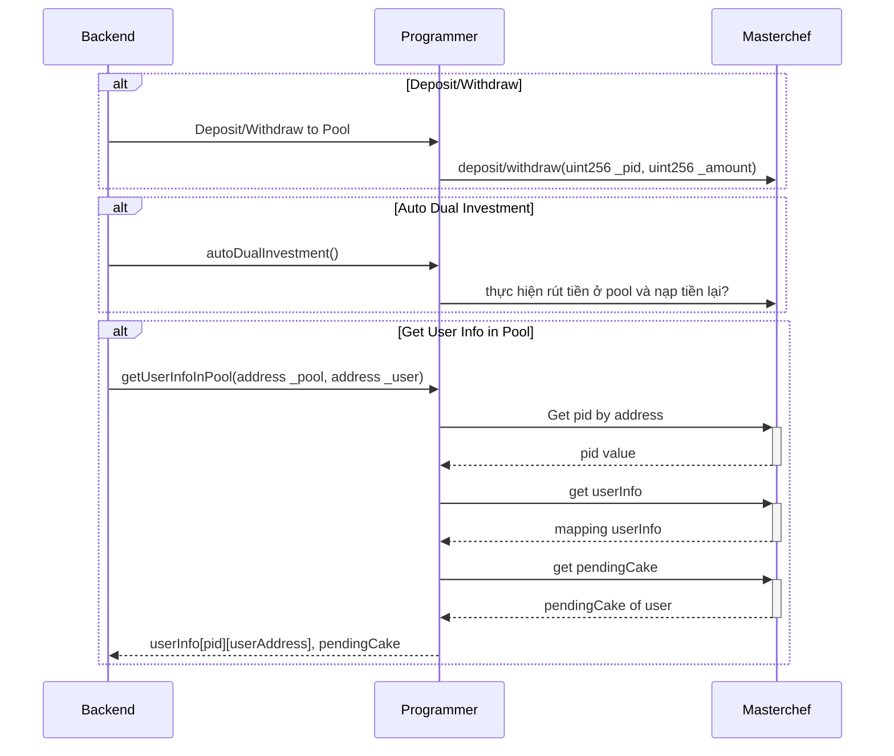

# auto-farming

Xây dựng công cụ tự động farming
- smartcontract cho phép người dùng gửi token vào các Liquidity Pool trên pancakeswap để đầu tư
- Hằng ngày sẽ tự động thu lãi và tiếp tục đem phần lãi đó đi tái đầu tư
- Lấy được lượng token người dùng đã gửi, lãi xuất đã thu được, tỉ lệ lãi xuất

# Smart Contract

## AnhToken
AnhToken contract là phần thưởng của user đi gửi vào các farming pool

## [PancakeRouter](https://github.com/pancakeswap/pancake-swap-periphery/blob/master/contracts/PancakeRouter.sol)
PancakeRouter contract để tạo pool -> Lấy đc địa chỉ pair

## [MasterChef](https://github.com/pancakeswap/pancake-farm/blob/master/contracts/MasterChef.sol)
Nạp rút tiền từ pool, tạo pool

## Programmer
Programmer contract có nhiệm vụ tự động hoá việc farming

```solidity
function getUserInfoInPool(address _pool, address _user)
function autoDualInvestment()
```

# Backend

## CronJob
- Mỗi ngày 7h sáng sẽ gọi đến 1 public api updateCumulativeInterest() trong Programmer contract (cloud cheduler nếu dùng GCP hoặc Job Scheduling nếu dùng AWS)

## API
- Get userInfo (Gọi function getUserInfoInPool trong Programmer contract)

BNB-USDT -> BNB || USDT -> cộng dồn total amount của user
Từ pool pancake (MasterChef) trả về () smart contract mình

BNB || USDT swap sang token của mình và trả
Từ smart contract trả User

## Flow diagram

